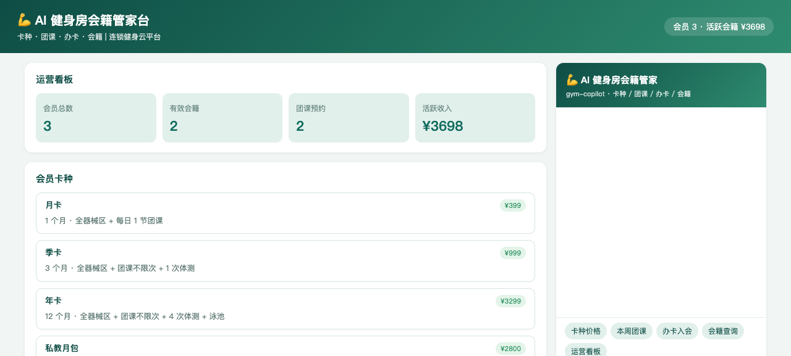
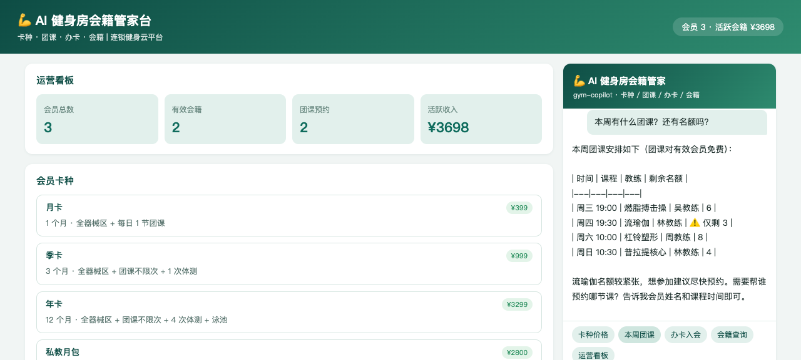
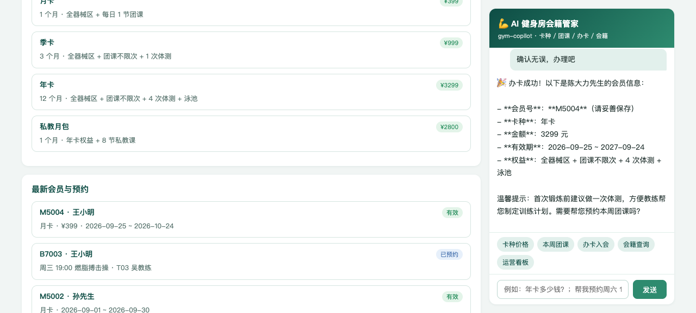
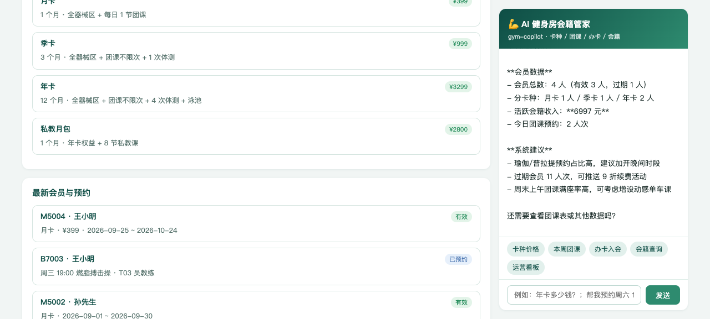

# gym-membership · AI 健身房会籍管家（DSH Java Native Plugin 场景案例 P68）

> 基于 [deepseek-harness-java（DSH）](https://github.com/deepseek-harness-java) Java Native Plugin 机制构建的连锁健身房会籍智能管家：卡种查询、团课查询、办卡入会、会籍查询、团课预约、运营统计，一个 Agent 全搞定。

  

## ✨ 功能一览

| 能力 | 说明 |
|------|------|
| 🏷️ 卡种查询 | 4 种会员卡（月卡 399 / 季卡 999 / 年卡 3299 / 私教月包 2800）权益与价格 |
| 📅 团课查询 | 本周课表：时间 / 课程 / 教练 / 剩余名额 |
| 📝 办卡入会 | AI 先复述卡种、价格、权益、有效期，经确认后办理，返回会员号 |
| 👤 会籍查询 | 会员号查卡种 / 有效期 / 权益 / 状态，过期提示 9 折续费 |
| 🎯 团课预约 | 校验余位，预约成功返回预约号并提醒提前 10 分钟到场 |
| 📊 运营统计 | 会员数 / 有效与过期 / 活跃收入 / 分卡种分布 / 续费与排课建议 |

## 🖼️ 界面预览

| 截图 | 说明 |
|------|------|
|  | 运营看板首屏：会员总数 / 有效会籍 / 团课预约 / 活跃收入 + 卡种列表 |
|  | AI 团课咨询：本周课表 + 余位提醒（流瑜伽仅剩 3） |
|  | AI 办卡流程：要素复述确认 → 办卡成功（会员号 M5004） |
|  | AI 运营统计：会员分布 / 收入 / 运营建议 |

## 🏗️ 项目结构

```
gym-membership/
├── pom.xml                 # Maven 聚合工程（p-app + p-plugin）
├── p-app/                  # Spring Boot 业务应用（端口 18107）
│   └── src/main/java/cn/xiaofuge/i/app/
│       ├── GymApplication.java      # 启动类
│       ├── IStore.java              # 数据中心（卡种/教练/团课/会员/预约）
│       ├── IController.java         # REST 接口（6 端点）
│       └── AssistantController.java # 页面消息 SSE 代理到 DSH
└── p-plugin/               # DSH Java Native 插件（agentId: gym-copilot）
    └── src/main/java/cn/xiaofuge/i/plugin/
        └── GymPlugin.java           # 6 个 AI 工具 + 系统提示词 + Hook
```

## 🔧 AI 工具集（6 个）

| 工具名 | 功能 | 关键约束 |
|--------|------|----------|
| `plan_list` | 会员卡种查询 | 含 3 位教练专长与课时费 |
| `class_list` | 本周团课表 | 时间/课程/教练/余位 |
| `join` | 办卡入会 | **必须先复述要素经顾客确认后才能调用** |
| `member_info` | 会籍查询 | 过期会员自动提示续费优惠 |
| `book` | 团课预约 | 校验余位；成功报预约号 |
| `stats` | 运营统计 | 提供续费与排课建议 |

## 🚀 快速开始

```bash
# 1. 构建业务应用
mvn clean package -DskipTests

# 2. 启动应用（端口 18107）
SERVER_PORT=18107 java -jar p-app/target/p-app-1.0.0-SNAPSHOT.jar

# 3. 插件 jar 放入 DSH 插件目录
cp p-plugin/target/p-plugin-1.0.0-SNAPSHOT.jar ~/.dsh/standalone/plugins/gym-copilot.jar

# 4. 注册插件（DSH 运行中）
curl -X POST http://127.0.0.1:8090/api/harness/plugins/install \
  -H 'Content-Type: application/json' \
  -d '{"pluginId":"gym-copilot","displayName":"AI 健身房会籍管家","pluginVersion":"1.0.0","runtimeType":"JAVA_NATIVE","sourcePath":"'$HOME'/.dsh/standalone/plugins/gym-copilot.jar","entrypoint":"cn.xiaofuge.i.plugin.GymPlugin"}'

# 5. 激活插件
curl -X POST http://127.0.0.1:8090/api/harness/plugins/activate \
  -H 'Content-Type: application/json' -d '{"pluginId":"gym-copilot"}'

# 6. 启动 DSH standalone（如未运行）
cd ~/.dsh/standalone && java -Dspring.profiles.active=standalone -Dserver.port=8090 \
  -jar ~/.dsh/skills/dsh-java-plugin-skills/runtime/deepseek-harness-java-app.jar
```

打开 **http://127.0.0.1:18107** 即可开始对话。

## 🌐 REST 接口

| 方法 | 路径 | 说明 |
|------|------|------|
| GET | `/api/plans` | 卡种列表（含教练信息） |
| GET | `/api/classes` | 本周团课表 |
| POST | `/api/join` | 办卡 `{name, plan, phone}` |
| GET | `/api/member?memberId=` | 会籍查询 |
| POST | `/api/book` | 团课预约 `{member, classTime}` |
| GET | `/api/stats` | 运营统计 |
| POST | `/api/assistant/stream` | AI 对话 SSE 代理 |

## ✅ E2E 验证（agent_stream.sh 端到端）

| # | 用户消息 | 调用工具 | 结果 |
|---|----------|----------|------|
| 1 | 介绍一下会员卡种和价格 | plan_list | ✅ 4 卡种 + 3 教练表格化输出 |
| 2 | 本周有什么团课，还有名额吗 | class_list | ✅ 4 节课余位，流瑜伽紧张提醒 |
| 3 | 查会员 M5001 会籍状态 | member_info | ✅ 钱女士 / 年卡 / 有效 / 泳池权益 |
| 4 | 帮王小明办月卡 | join | ✅ 会员号 M5004，¥399 |
| 5 | 帮王小明预约周三 19:00 搏击操 | book | ✅ 预约号 B7003，余位 6→5 |
| 6 | 今天运营情况 | stats | ✅ 会员 4 人 / 活跃收入 ¥4097 / 建议 |

## 🔑 技术要点

- **DSH Java Native Plugin**：`AbstractHarnessPlugin` + `AbstractTool`，工具以 `plugin__gym-copilot__<name>` 暴露给 LLM
- **系统提示词注入**：`registerSystemPrompt` 固化「办卡前必须复述要素确认」「健康建议仅常识性提醒」等业务红线
- **PRE_TOOL_USE Hook**：所有工具调用注入审计上下文
- **SSE 透传**：页面消息经 `AssistantController` 代理到 DSH `/api/agent/stream`（agentId=gym-copilot，超时 180s）
- **纯内存数据**：`IStore` 演示用，重启即还原种子数据

## 📄 License

MIT
